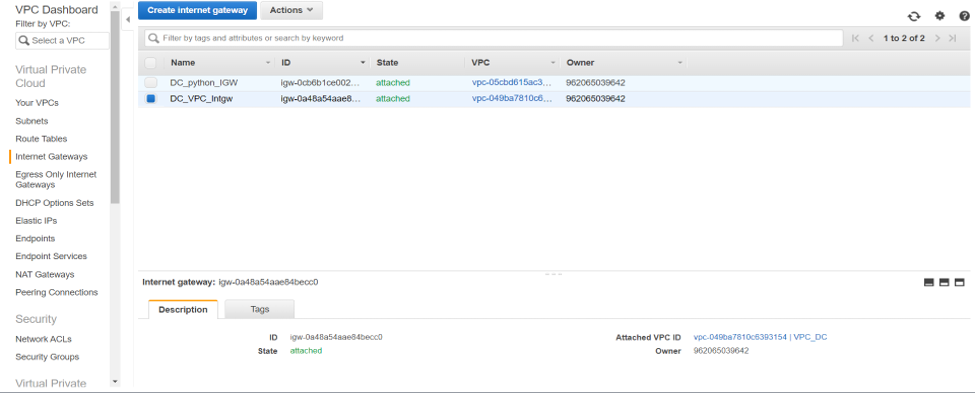
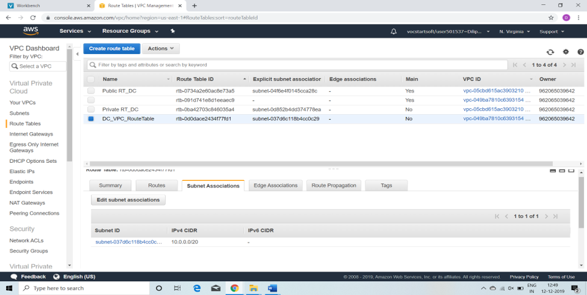
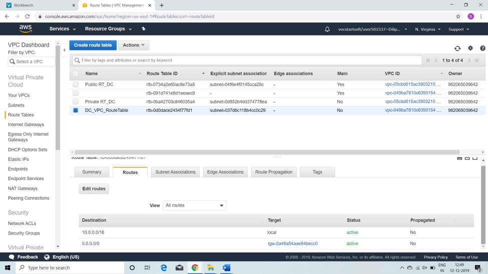
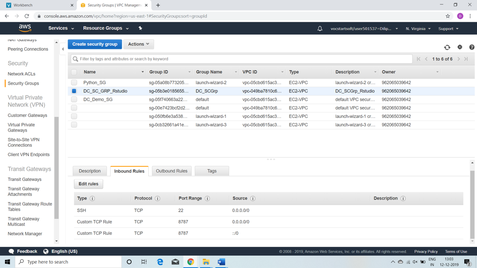
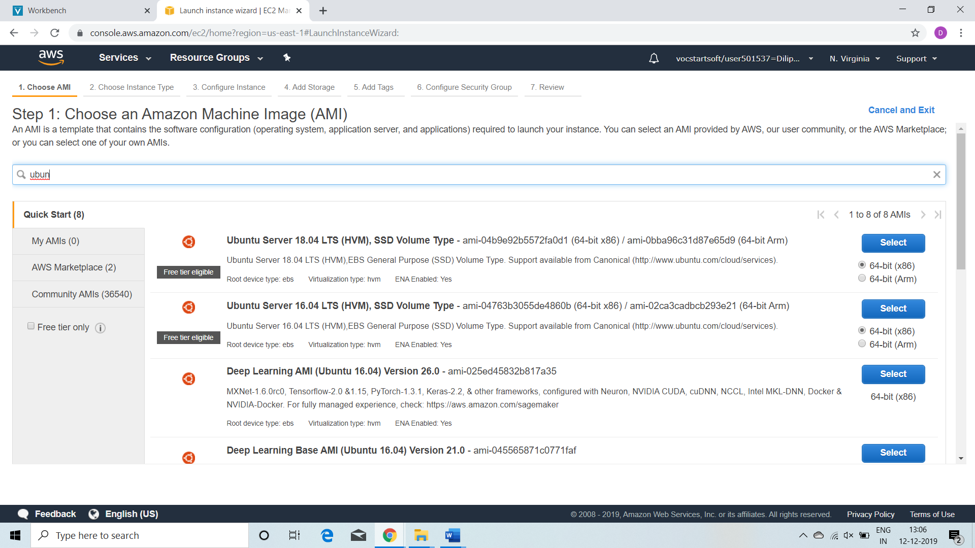
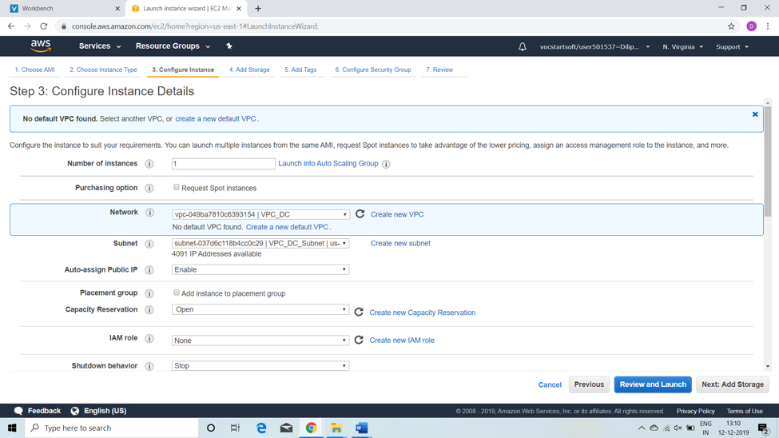
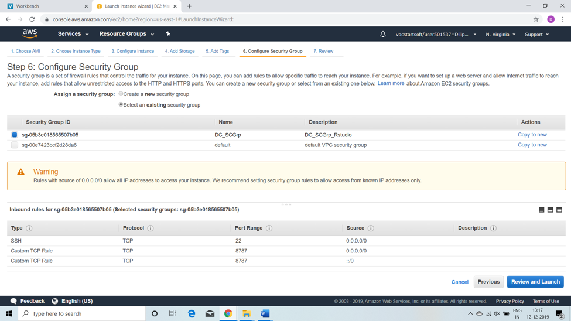
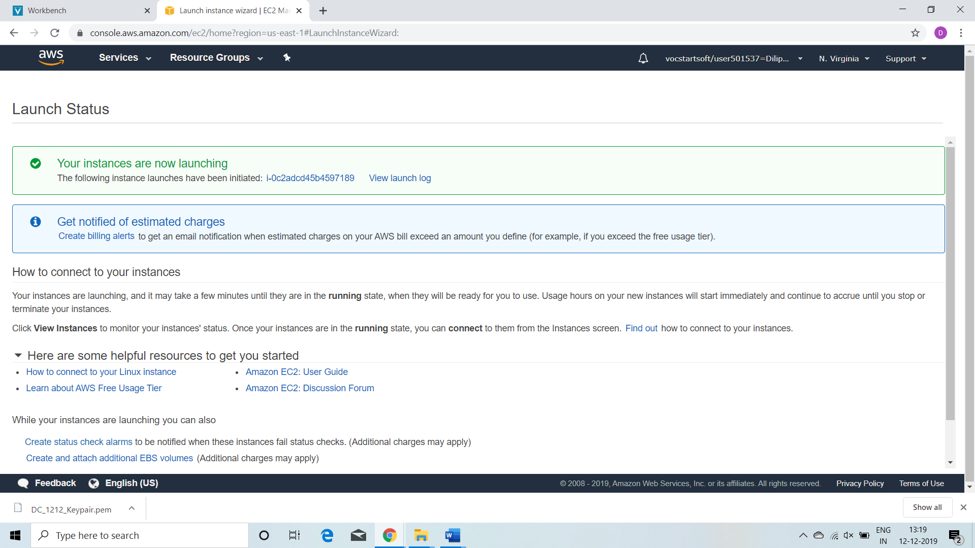
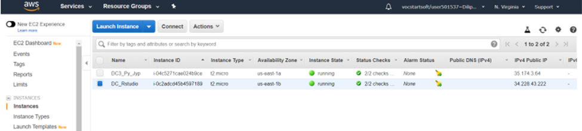
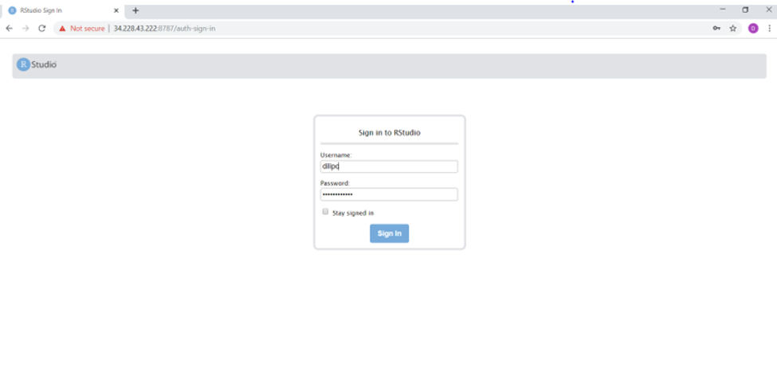

# R_studio_AWS_DC

## Process walk-through for R-Studio Server installation on Amazon AWS

### Creation of VPC instance for Rstudio :
Step 1 : Login in to your AWS account 
Step 2 : Create a VPC (CIDR: 10.0.0.0/16) like DC_Rstudio
Step 3 : Create a public subnet (CIDR: 10.0.0.0/24)
Step 4 : Create an Internet Gateway and attached to the VPC ( DC_VPC_Intgw) 

 
Step 5 : Create and edit the Route table.  

Now Click on the subnet association tab and associate this route table to the subnet

 
Step 6 : Create security create a security group [Inbound / Outbound Rules] in which we should open the port 8787 which has been associated with Rstudio Server.

 

### EC2 AWS Rstudio Server Connection :
Now Create your EC2 for Rstudio server instance
Step 1 : Select “Ubuntu Sever 1804 LTS [HVM], SSD volume Type”

 

Step 2 : 
Now “Choose Instance Type” page no need to update anything only will have to select VPC.
Step 3 :
 Go to the Configure instance details page check for Network & Subnet.
In advanced option, will have to copy the script which downloads the Rserver package and install. Also this script enable User Id and Password.

Step 4 : Now Next Page “Add Storage” and “Add Tags” no need to update anything.
Step 5: Finally, “Configure Security Group” page will have to click on Review and Launch

Now wait for few seconds to change Instance State to change “running” for DC_Rstudio.
 

Bingo…. Now use browser to connect Rstudio  on Amazon AWS [Public IP : 34.228.43.222]

Thanx 😊

